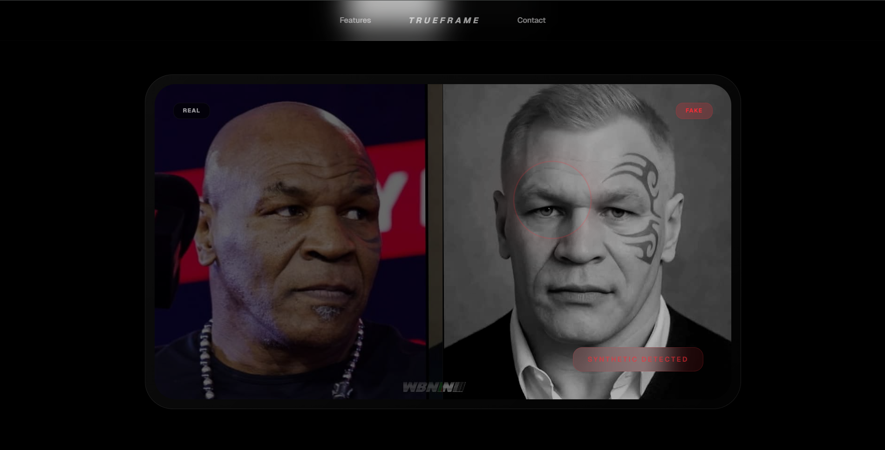

# TrueFrame AI



<p align="center">
  
  
  
  
  
  
</p>

TrueFrame AI is a comprehensive deepfake detection platform. It provides a robust machine learning pipeline for detecting manipulated videos using Convolutional Neural Networks (ResNet18) and a modern, user-friendly web interface.

## Table of Contents
- [Project Overview](#project-overview)
- [Repository Structure](#repository-structure)
- [Getting Started](#getting-started)
- [Development Workflow](#development-workflow)

## Project Overview

With the rapid advancement of AI-generated media, distinguishing real videos from deepfakes has become a critical challenge. TrueFrame AI addresses this by combining an optimized PyTorch-based training pipeline with a Fast API backend and a responsive Next.js frontend.

### Key Components
1. **Machine Learning Server (`/server`)**: A PyTorch backend that handles dataset loading, model training, evaluation, and serves the classification model via FastAPI.
2. **Web Client (`/client`)**: A modern React frontend built with Next.js and Tailwind CSS that allows users to seamlessly upload videos and visualize the model's confidence scores.

## Repository Structure

The project is structured as a monorepo containing both the frontend client and the backend server:

```text
trueframe-ai/
├── client/          # Next.js React frontend
│   ├── app/         # App router (pages, layouts)
│   ├── components/  # React components
│   └── public/      # Static web assets
│
└── server/          # PyTorch & FastAPI backend
    ├── app/         # FastAPI endpoints and schemas
    ├── src/         # ML pipeline (training, dataset, evaluation)
    ├── configs/     # Project configuration (hyperparameters)
    └── data/        # Datasets (git-ignored)
```

## Getting Started

To run the full TrueFrame AI platform locally, you will need to start both the server and the client.

### 1. Start the Server (Backend)

The backend uses `uv` for lightning-fast Python dependency management.

```powershell
# Navigate to the server folder
cd server

# Install dependencies
uv sync

# Run the FastAPI development server
uv run fastapi dev app/main.py
```
*The server will start on `http://127.0.0.1:8000`. Ensure this is running before interacting with the frontend.*

### 2. Start the Client (Frontend)

The frontend uses standard Node.js package managers.

```powershell
# Navigate to the client folder (in a new terminal)
cd client

# Install dependencies
npm install

# Run the Next.js development server
npm run dev
```
*The client will start on `http://localhost:3000`. Open this in your browser to use TrueFrame AI.*

## Development Workflow

- **Backend Development**: For details on the ML training loop, evaluating the ResNet model, or adding new API endpoints, refer to the [Server README](./server/README.md).
- **Frontend Development**: For details on modifying the UI components or Tailwind styling, refer to the [Client README](./client/README.md).
